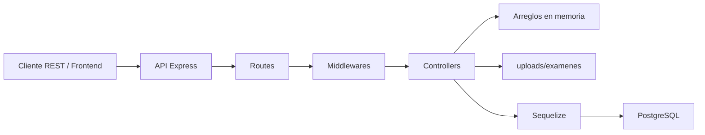
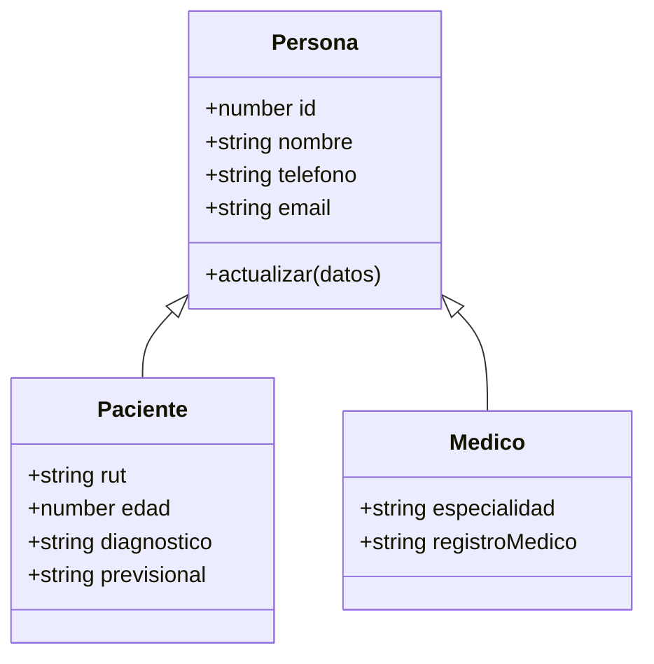
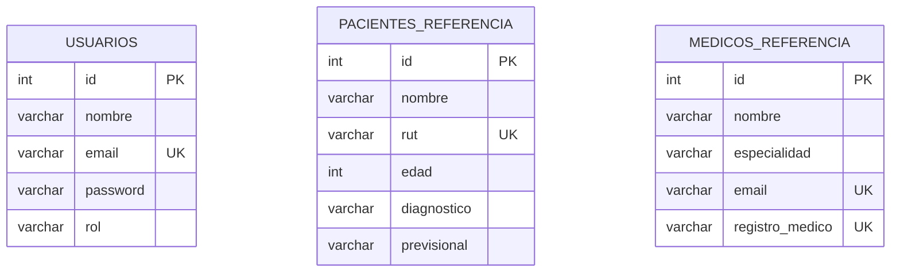
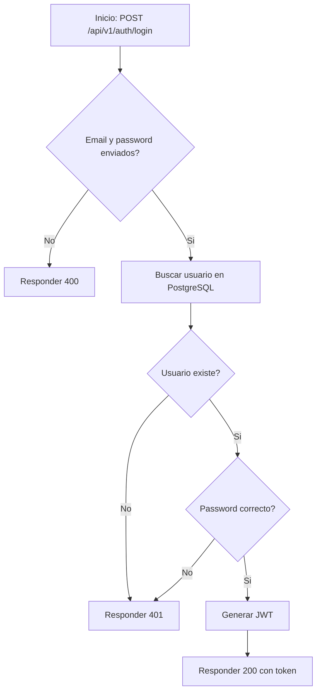
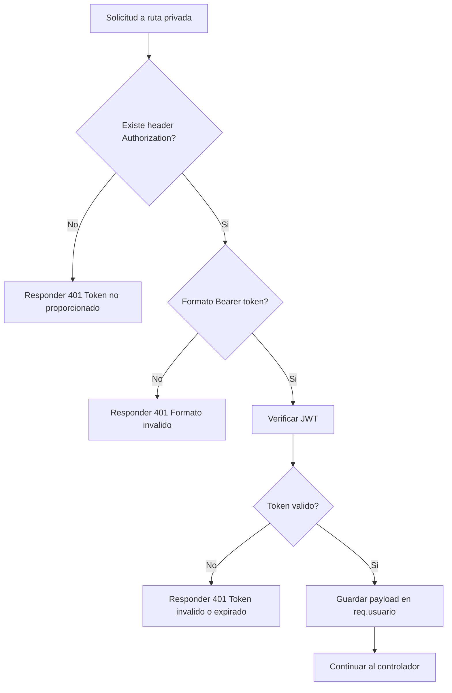
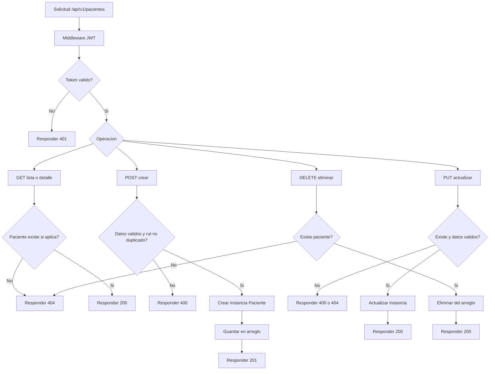
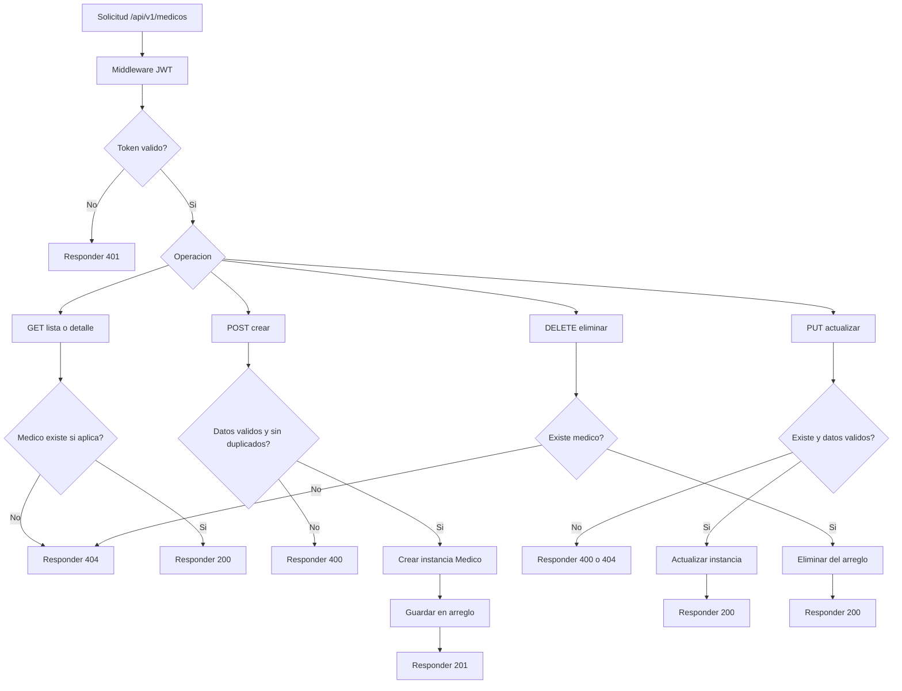
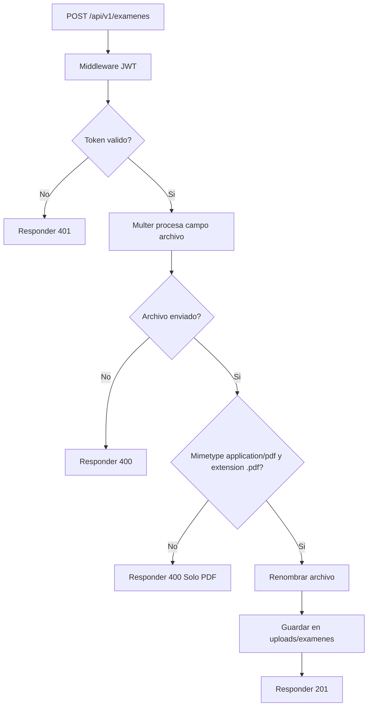
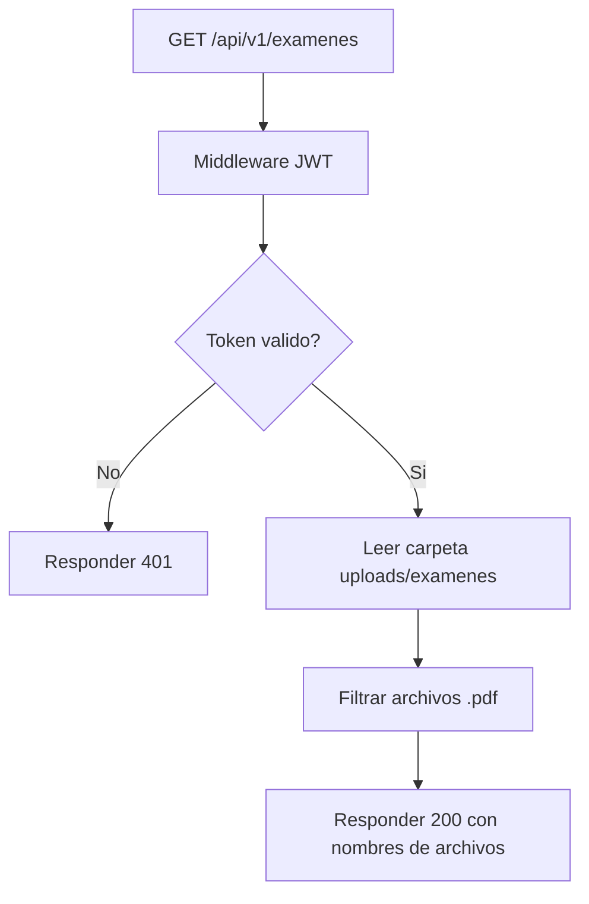
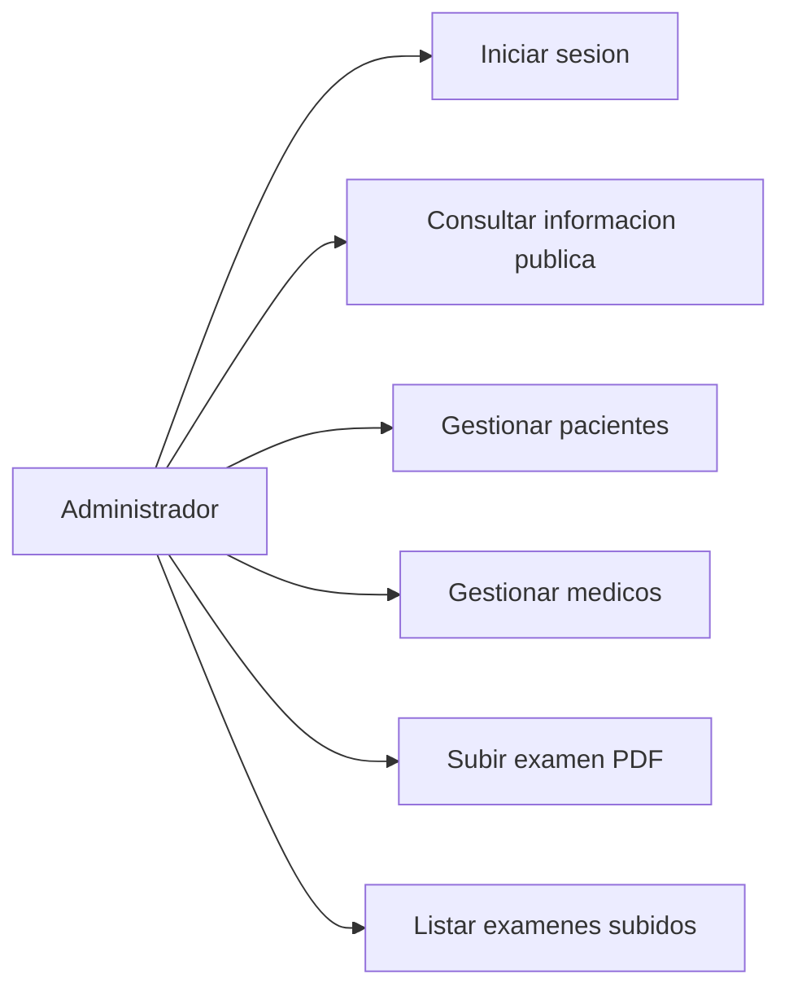

# Documentacion Tecnica Backend - API Clinica Modulo 8

## 1. Objetivo

Implementar una API REST empresarial con Node.js y Express para gestionar informacion de una clinica. El backend permite autenticacion JWT, operaciones CRUD de pacientes y medicos, subida de examenes PDF y listado de archivos cargados al servidor.

## 2. Alcance Del Backend

El backend incluye:

- Endpoint publico de informacion general.
- Login con JWT.
- Middleware de autenticacion para rutas privadas.
- CRUD de pacientes en memoria.
- CRUD de medicos en memoria.
- Subida de examenes PDF.
- Listado de nombres de archivos subidos.
- Conexion PostgreSQL con Sequelize para usuarios.
- SQL inicial para crear la base de datos y usuario administrador.
- Pruebas funcionales mediante archivo `.rest`.

El frontend se desarrolla en otro repositorio y consume esta API por HTTP.

Repositorio frontend:

```text
https://github.com/AinilSepulveda/FrontEnd-medecina
```

Este repositorio backend no contiene la interfaz web. Para levantar o revisar el frontend se debe usar el repositorio anterior.

## 3. Requerimientos Funcionales

| ID | Requerimiento | Estado |
| --- | --- | --- |
| RF01 | El sistema debe permitir login de usuario administrador. | Implementado |
| RF02 | El sistema debe generar un token JWT al iniciar sesion correctamente. | Implementado |
| RF03 | El sistema debe exponer un endpoint publico `acerca`. | Implementado |
| RF04 | El sistema debe proteger rutas privadas con JWT. | Implementado |
| RF05 | El sistema debe listar pacientes. | Implementado |
| RF06 | El sistema debe crear pacientes. | Implementado |
| RF07 | El sistema debe actualizar pacientes. | Implementado |
| RF08 | El sistema debe eliminar pacientes. | Implementado |
| RF09 | El sistema debe listar medicos. | Implementado |
| RF10 | El sistema debe crear medicos. | Implementado |
| RF11 | El sistema debe actualizar medicos. | Implementado |
| RF12 | El sistema debe eliminar medicos. | Implementado |
| RF13 | El sistema debe permitir subir examenes solo en PDF. | Implementado |
| RF14 | El sistema debe listar nombres de archivos PDF subidos. | Implementado |
| RF15 | El sistema debe responder con codigos HTTP adecuados. | Implementado |

## 4. Requerimientos No Funcionales

| ID | Requerimiento | Descripcion |
| --- | --- | --- |
| RNF01 | Seguridad | Las rutas privadas requieren token JWT valido. |
| RNF02 | Mantenibilidad | El codigo se organiza por rutas, controladores, middlewares, datos y clases. |
| RNF03 | Configuracion | Variables sensibles y de entorno se manejan mediante `.env`. |
| RNF04 | Compatibilidad | La API responde en formato JSON. |
| RNF05 | Validacion | Los datos requeridos se validan antes de crear o actualizar recursos. |
| RNF06 | Trazabilidad | Las pruebas se documentan en `requests/rutas.rest`. |

## 5. Reglas De Negocio

1. Para iniciar sesion se requiere `email` y `password`.
2. Las credenciales invalidas deben responder `401`.
3. Las rutas de pacientes, medicos y examenes requieren JWT.
4. Los pacientes requieren `nombre`, `rut`, `edad` y `diagnostico`.
5. La edad del paciente debe ser un numero entero mayor o igual a 0.
6. No se permite crear pacientes con `rut` duplicado.
7. Los medicos requieren `nombre`, `especialidad`, `email` y `registroMedico`.
8. No se permite crear medicos con `email` o `registroMedico` duplicado.
9. Solo se aceptan examenes en formato PDF.
10. El campo de subida de archivo debe llamarse `archivo`.
11. Los archivos PDF se guardan en `uploads/examenes`.

## 6. Arquitectura General



## 7. Estructura Del Proyecto

```text
database/
  init.sql
docs/
  documentacion-tecnica-backend.md
requests/
  rutas.rest
  examen-prueba.pdf
src/
  classes/
    Persona.js
    Paciente.js
    Medico.js
  controllers/
  data/
  middlewares/
  models/
  routes/
  services/
uploads/
  examenes/
index.js
```

## 8. Modelo De Clases Con Herencia

El backend usa herencia para representar personas de la clinica:

- `Persona` es la clase base.
- `Paciente` hereda de `Persona`.
- `Medico` hereda de `Persona`.



## 9. Modelo Relacional PostgreSQL

PostgreSQL se usa para usuarios del sistema y login. El archivo `database/init.sql` crea la base inicial.



Nota: pacientes y medicos operativos se trabajan en memoria para cumplir el requerimiento de la actividad backend.

## 10. Flujo De Login



## 11. Flujo De Autenticacion JWT



## 12. Flujo CRUD Pacientes



## 13. Flujo CRUD Medicos



## 14. Flujo Subida De Examen PDF



## 15. Flujo Listado De Examenes



## 16. Casos De Uso



## 17. Codigos HTTP

| Codigo | Uso |
| --- | --- |
| 200 | Consulta, actualizacion o eliminacion correcta |
| 201 | Creacion correcta o subida de PDF correcta |
| 400 | Campos faltantes, datos invalidos, duplicados o archivo no permitido |
| 401 | Credenciales invalidas, token ausente, token invalido o token expirado |
| 404 | Ruta inexistente o recurso no encontrado |
| 500 | Error interno del servidor |

## 18. Endpoints

### Publicos

| Metodo | Ruta | Descripcion |
| --- | --- | --- |
| GET | `/` | Estado general de la API |
| GET | `/api/v1/acerca` | Informacion publica de la API |
| POST | `/api/v1/auth/login` | Login y generacion de token |
| GET | `/health` | Verificacion de conexion con base de datos |

### Privados

| Metodo | Ruta | Descripcion |
| --- | --- | --- |
| GET | `/api/v1/auth/perfil` | Valida token |
| GET | `/api/v1/pacientes` | Lista pacientes |
| GET | `/api/v1/pacientes/:id` | Obtiene paciente |
| POST | `/api/v1/pacientes` | Crea paciente |
| PUT | `/api/v1/pacientes/:id` | Actualiza paciente |
| DELETE | `/api/v1/pacientes/:id` | Elimina paciente |
| GET | `/api/v1/medicos` | Lista medicos |
| GET | `/api/v1/medicos/:id` | Obtiene medico |
| POST | `/api/v1/medicos` | Crea medico |
| PUT | `/api/v1/medicos/:id` | Actualiza medico |
| DELETE | `/api/v1/medicos/:id` | Elimina medico |
| GET | `/api/v1/examenes` | Lista archivos PDF subidos |
| POST | `/api/v1/examenes` | Sube examen PDF |

## 19. Pruebas Funcionales

Las pruebas estan documentadas en:

```text
requests/rutas.rest
```

Casos cubiertos:

- Login correcto.
- Login con campos faltantes.
- Login con credenciales invalidas.
- Acceso privado sin token.
- Acceso privado con token.
- CRUD completo de pacientes.
- CRUD completo de medicos.
- Subida correcta de PDF.
- Rechazo de archivo no PDF.
- Listado de examenes.

## 20. Consideraciones De Seguridad

- JWT se firma con `JWT_SECRET` desde `.env`.
- El token tiene expiracion configurable con `JWT_EXPIRES_IN`.
- Las rutas privadas usan middleware centralizado.
- Los archivos subidos se limitan a PDF.
- El tamano maximo de archivo es 5 MB.

## 21. Limitaciones

- Las contrasenas estan en texto plano por fines didacticos.
- Pacientes y medicos se almacenan en memoria, por lo que se pierden al reiniciar el servidor.
- El frontend se encuentra en otro repositorio.
